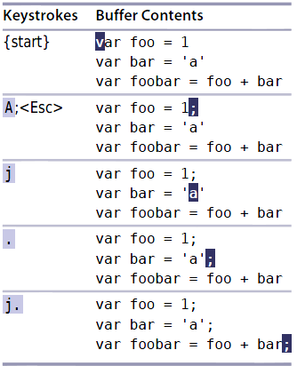

# 技巧2: 不要自我重复

1. `$`:光标移动到当前行的末尾
2. `I`:在光标所在字符所在行的开头插入内容
3. `i`:在光标所在字符的上一个字符位置插入内容
4. `a`:在光标所在字符的下一个字符位置插入内容
5. `A`:在光标所在字符所在行的结尾插入内容

### 例子:每行结尾插入`;`字符

1. `$a;<Esc>`:光标移动到改行末尾(`$`),在末尾插入(`a`), 插入字符(`;`),退回到普通模式(`<Esc>`)  
2. `j$a;<Esc>`:光标移动到下一行(`j`),光标移动到改行末尾(`$`),在末尾插入(`a`), 插入字符(`;`),退回到普通模式(`<Esc>`)  
3. `j$a;<Esc>`:光标移动到下一行(`j`),光标移动到改行末尾(`$`),在末尾插入(`a`), 插入字符(`;`),退回到普通模式(`<Esc>`)  
4. ...

### 减少无关操作

`A`替代了`$a`的功能，为了减少按键，应该使用`A`,上面的操作变成

> `A;<Esc>`
> `jA;<Esc>`
> `jA;<Esc>`
> ...

### 例子： 每行末尾加上`;`
  

   

|上一篇|下一篇|
|:---|---:|
|[Tip1 认识`.`命令](tip1.md)|[Tip3 以退为进](tip3.md)|
